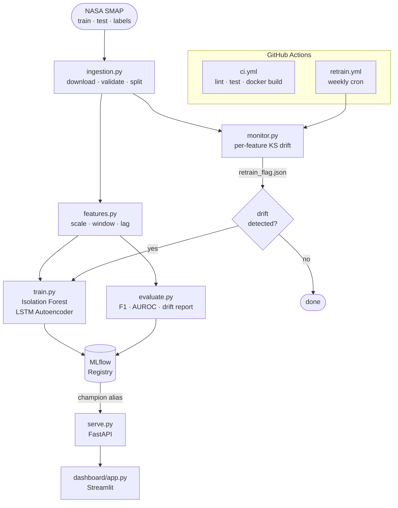

# SensorFlow

[](https://github.com/marcosalmistraro/sensorflow/actions/workflows/ci.yml)
[](https://www.python.org/downloads/)
[](https://mlflow.org)
[](LICENSE)

Production-grade anomaly detection service for NASA SMAP satellite telemetry.  
Isolation Forest + LSTM Autoencoder · MLflow experiment tracking · Evidently drift monitoring · FastAPI · automated weekly retraining via GitHub Actions.

> **Live demo** — dashboard: _deploy to Hugging Face Spaces_ · API docs: _deploy to Render_

---

## Architecture



---

## Stack

| Layer | Tool |
|---|---|
| Dataset | NASA SMAP via [khundman/telemanom](https://github.com/khundman/telemanom) |
| Models | Isolation Forest (scikit-learn) · LSTM Autoencoder (PyTorch) |
| Experiment tracking | MLflow (self-hosted) |
| Drift monitoring | Evidently AI · SciPy KS test |
| API | FastAPI + uvicorn |
| Dashboard | Streamlit + Plotly |
| Containerisation | Docker + Docker Compose |
| CI/CD | GitHub Actions |
| Deployment | Hugging Face Spaces (dashboard) · Render (API) |

---

## Quickstart

### Local (step by step)

```bash
git clone https://github.com/marcosalmistraro/sensorflow.git
cd sensorflow

python -m venv venv && source venv/bin/activate   # Windows: venv\Scripts\activate
pip install torch --index-url https://download.pytorch.org/whl/cpu
pip install -r requirements.txt

# 1. Download SMAP data (~50 MB)
make ingest

# 2. Build feature arrays
make features

# 3. Train both models, log to MLflow
make mlflow-ui &   # optional — view runs at localhost:5000
make train

# 4. Evaluate, generate drift report, promote champion
make evaluate

# 5. Start the API
make serve         # localhost:8000/docs

# 6. Start the dashboard (separate terminal)
make dashboard     # localhost:8501
```

### Docker (everything at once)

Run the pipeline locally first to produce model artefacts, then:

```bash
# After make ingest + make features + make train + make evaluate:
docker compose up --build
```

| Service | URL |
|---|---|
| MLflow UI | http://localhost:5000 |
| API docs | http://localhost:8000/docs |
| Dashboard | http://localhost:8501 |

---

## Project structure

```
sensorflow/
├── src/
│   ├── config.py        # Pydantic BaseSettings — all env vars
│   ├── ingestion.py     # Download SMAP, validate, split → parquet
│   ├── features.py      # Sliding window, scaling, lag features
│   ├── train.py         # Isolation Forest + LSTM Autoencoder + MLflow
│   ├── evaluate.py      # F1/AUROC + Evidently drift report
│   ├── serve.py         # FastAPI /predict /health /metrics
│   └── monitor.py       # Per-feature KS drift → retrain flag
├── dashboard/
│   └── app.py           # Streamlit frontend
├── tests/               # 92 unit tests (pytest)
├── .github/workflows/
│   ├── ci.yml           # Lint · type-check · test · Docker build
│   └── retrain.yml      # Weekly cron: monitor → retrain → promote
├── Dockerfile.api
├── Dockerfile.dashboard
├── docker-compose.yml
└── Makefile
```

---

## Configuration

All settings are controlled via environment variables (or a `.env` file).  
See [`.env.example`](.env.example) for the full list. Key values:

| Variable | Default | Description |
|---|---|---|
| `MLFLOW_TRACKING_URI` | `http://localhost:5000` | MLflow server |
| `WINDOW_SIZE` | `64` | LSTM sliding window length |
| `IF_CONTAMINATION` | `0.05` | Expected anomaly fraction |
| `LSTM_EPOCHS` | `30` | Max training epochs |
| `DRIFT_THRESHOLD` | `0.5` | Fraction of drifted features that triggers retrain |

---

## How it works

**Two complementary models** are trained on the same data:

- **Isolation Forest** — scores each timestep by how few random cuts are needed to isolate it. Anomalies are sparse and isolated; normal points are surrounded by neighbours. Operates on flat lag-feature vectors (25 features × 6 time points = 150 dimensions).

- **LSTM Autoencoder** — learns to compress and reconstruct 64-timestep windows. Trained only on normal data; anomalous windows produce high reconstruction error. Threshold set at the 95th percentile of training errors.

**Both models are tracked in MLflow.** After evaluation, the model with the higher F1 score on the labeled test set is promoted to the `champion` alias in the Model Registry. The other is tagged `challenger`.

**Drift is monitored weekly** via a per-feature two-sample Kolmogorov-Smirnov test. If more than 50% of the 25 sensor channels show statistically significant distribution shift, the retrain workflow is triggered automatically.

---

## Tests

```bash
make test
# 92 tests across config, ingestion, features, train, evaluate, serve, monitor
```

---

## License

MIT
